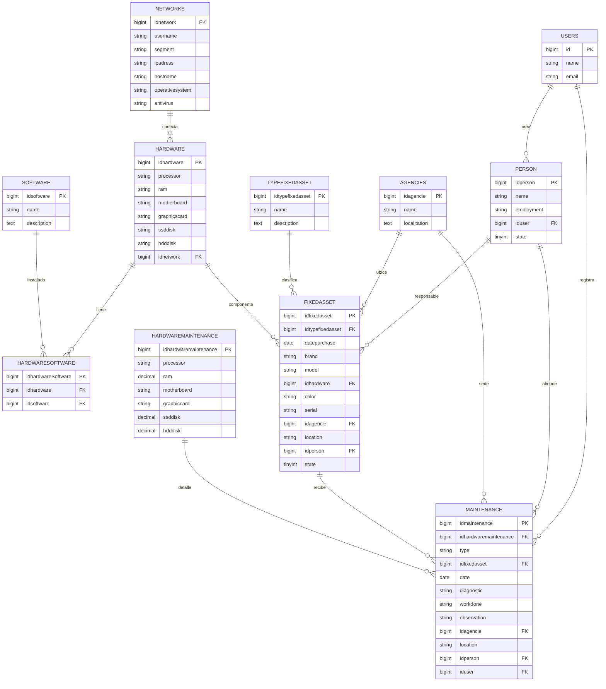

# Diagrama Entidad-Relación (Mantenimientos)

## Nota
- Este diagrama está basado en las migraciones actuales de `database/migrations`.
- Algunos nombres de tabla/campo se dejaron tal cual en el proyecto (por ejemplo `person`, `idagencie`, `typefixedasset`).
